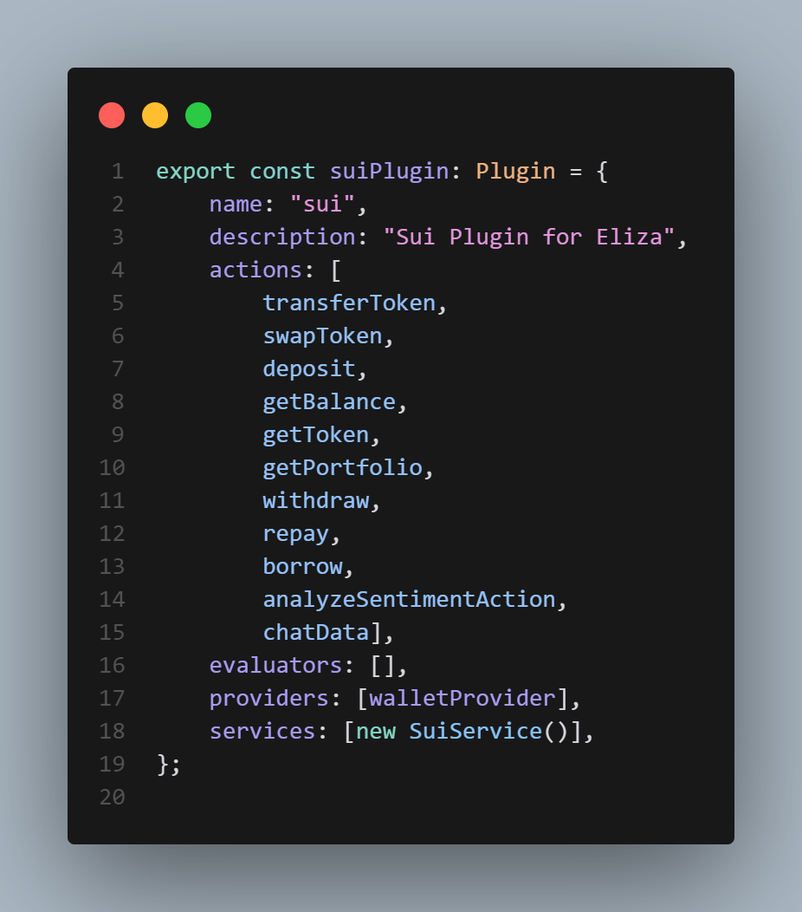
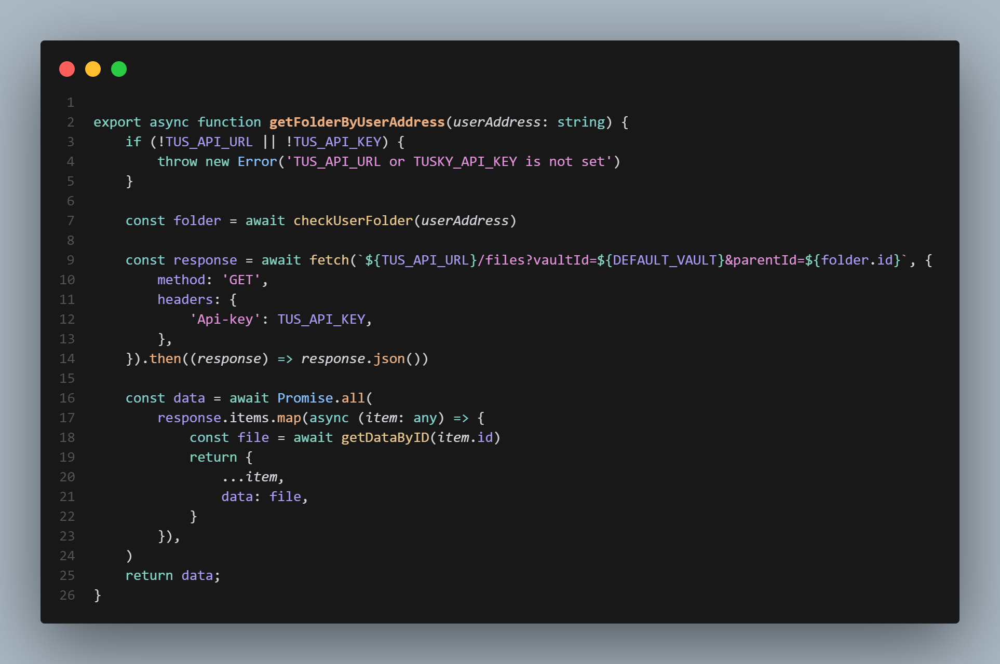
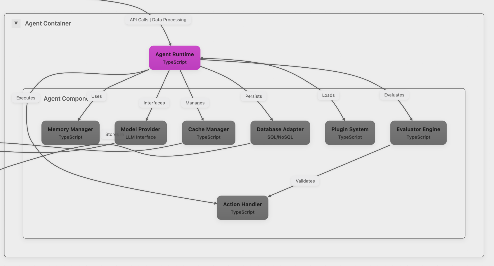

# FlyFish Sui Plugin

## Overview
FlyFish Sui Plugin is a comprehensive blockchain integration module designed to provide seamless interaction with the Sui blockchain ecosystem. It offers a robust set of features for wallet management, decentralized finance (DeFi) operations, and advanced blockchain analytics.

# Table of Contents
- [FlyFish Sui Plugin](#flyfish-sui-plugin)
  - [Overview](#overview)
- [Table of Contents](#table-of-contents)
- [Project structure](#project-structure)
  - [Response Format](#response-format)
  - [Core Capabilities](#core-capabilities)
    - [Suilend Integration](#suilend-integration)
    - [Get insights from data](#get-insights-from-data)
  - [Architecture](#architecture)

# Project structure
``` 
packages/plugin-sui/
├── .npmignore                 # NPM package ignore rules
├── package.json              # Package configuration and dependencies
├── src/
│   ├── actions/              # Action handlers for different operations
│   │   ├── suilend/         # SuiLend-specific actions
│   │   │   ├── analyze-portfolio.ts
│   │   │   ├── borrow.ts
│   │   │   ├── deposit.ts
│   │   │   ├── get-balance.ts
│   │   │   ├── get-portfolio.ts
│   │   │   ├── get-token.ts
│   │   │   ├── repay.ts
│   │   │   └── withdraw.ts
│   │   ├── analyze-sentiment.ts
│   │   ├── enum.ts          # Action type enums
│   │   ├── give-insight-data.ts
│   │   ├── prompts/        # LLM prompts for various operations
│   │   │   └── index.ts
│   │   ├── swap.ts
│   │   ├── transfer.ts
│   │   └── utils/          # Action utilities
│   │       └── index.ts
│   ├── providers/           # Service providers
│   │   └── wallet.ts       # Wallet provider implementation
│   ├── services/           # Core services
│   │   ├── sui.ts         # Main Sui service implementation
│   │   └── tusky.ts       # call tusky api
│   ├── tests/             # Test files
│   │   └── wallet.test.ts
│   ├── environment.ts      # Environment configuration
│   ├── index.ts           # Main plugin entry point
│   └── utils.ts           # General utilities
```

## Response Format
```json
{
    "text": "",
    "action": "",
    "params: ""
}
```

## Core Capabilities


### Suilend Integration
Using @suilend/sdk  and @suilend/frontend-sui to interact with suilend protocol
- Deposit
- Withdraw
- Borrow
- Repay

### Get insights from data

- Get data from tusky (walrus) which have been collected from flyfish extension then combine with knowledge base of flyfish agent to get insights from data

## Architecture

