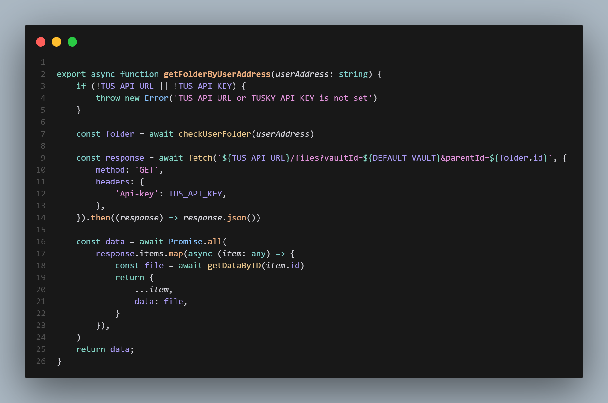

# Sui Plugin for Eliza OS Platform

## Overview
The Sui Plugin is a comprehensive blockchain integration module designed to provide seamless interaction with the Sui blockchain ecosystem. It offers a robust set of features for wallet management, decentralized finance (DeFi) operations, and advanced blockchain analytics.

# Table of Contents
- [Project Structure](#project-structure)
- [Core Capabilities](#core-capabilities)
- [Wallet Operations](#wallet-operations)
- [Lending Operations (SuiLend)](#lending-operations-suilend)
- [Social Media Analytics](#social-media-analytics)
- [Characteristics](#characteristics)

# Project structure
packages/plugin-sui/
├── .npmignore                 # NPM package ignore rules
├── package.json              # Package configuration and dependencies
├── src/
│   ├── actions/              # Action handlers for different operations
│   │   ├── suilend/         # SuiLend-specific actions
│   │   │   ├── analyze-portfolio.ts
│   │   │   ├── borrow.ts
│   │   │   ├── deposit.ts
│   │   │   ├── get-balance.ts
│   │   │   ├── get-portfolio.ts
│   │   │   ├── get-token.ts
│   │   │   ├── repay.ts
│   │   │   └── withdraw.ts
│   │   ├── analyze-sentiment.ts
│   │   ├── enum.ts          # Action type enums
│   │   ├── give-insight-data.ts
│   │   ├── prompts/        # LLM prompts for various operations
│   │   │   └── index.ts
│   │   ├── swap.ts
│   │   ├── transfer.ts
│   │   └── utils/          # Action utilities
│   │       └── index.ts
│   ├── providers/           # Service providers
│   │   └── wallet.ts       # Wallet provider implementation
│   ├── services/           # Core services
│   │   ├── sui.ts         # Main Sui service implementation
│   │   └── tusky.ts       # call tusky api
│   ├── tests/             # Test files
│   │   └── wallet.test.ts
│   ├── environment.ts      # Environment configuration
│   ├── index.ts           # Main plugin entry point
│   └── utils.ts           # General utilities

## Core Capabilities

### Wallet Operations
- Transfer tokens between addresses

- Swap tokens across different pools
- Manage wallet balances

### Lending Operations (SuiLend)
- Deposit tokens
- Withdraw funds
- Borrow against collateral
- Repay loans
- Check account balance
- View comprehensive portfolio

### Social Media Analytics
Integrate data:

- Analyze sentiment of blockchain-related content
- Generate insights from collected data

## Characteristics
This character is designed to be:
A technical expert in Sui blockchain
- Security-focused and risk-aware
- Professional and educational in communication
- Data-driven in analysis
- Comprehensive in blockchain knowledge
- Structured in response format

## Key Features
- Integration with Sui blockchain
- Real-time transaction processing
- Secure and efficient token management
- Basic DeFi functionality
- Social media data intelligence
